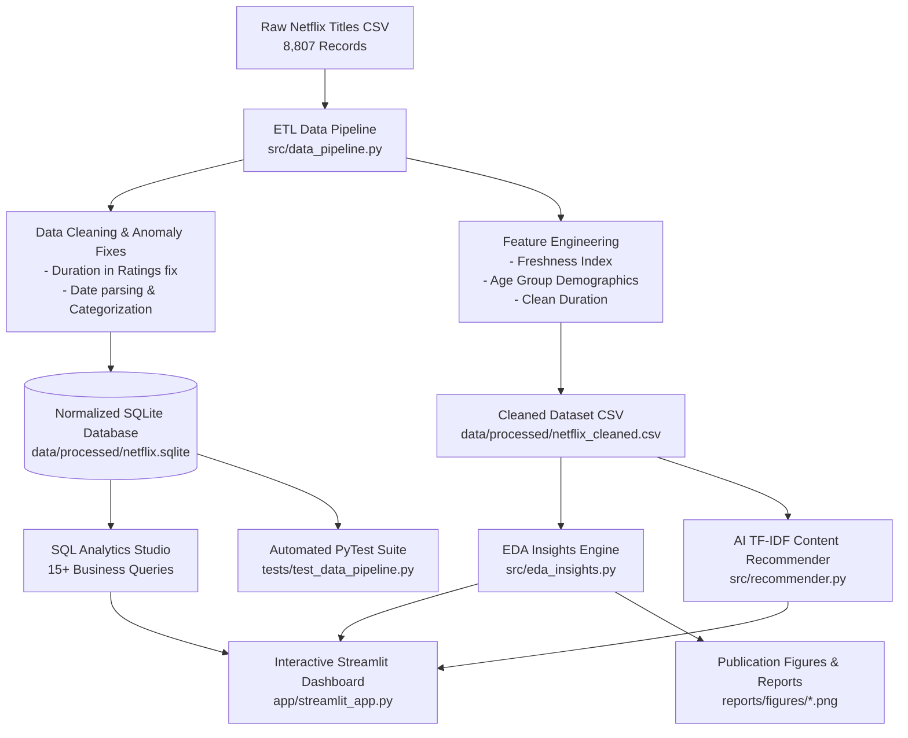
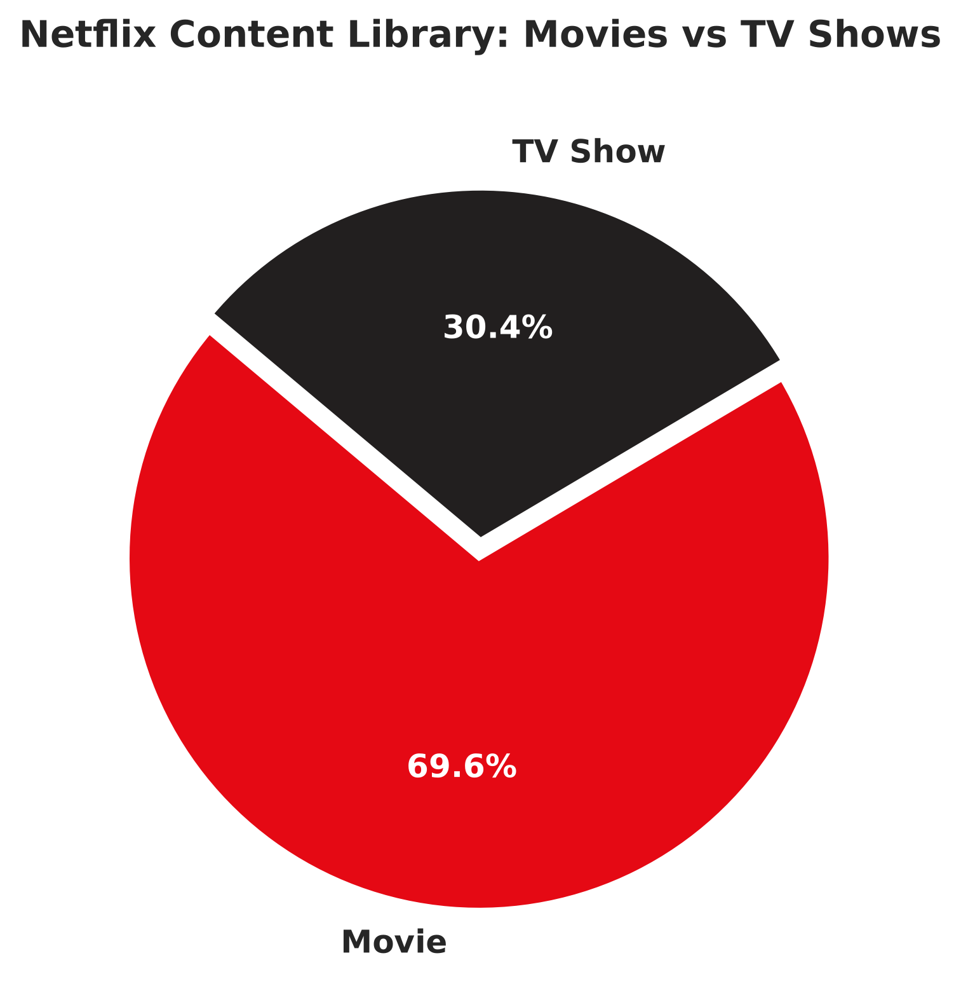
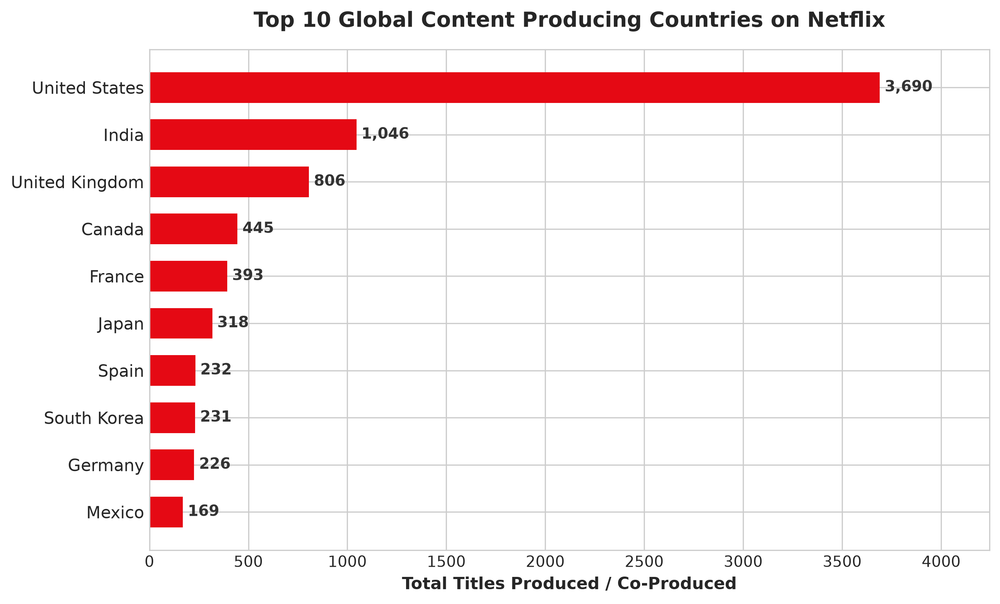
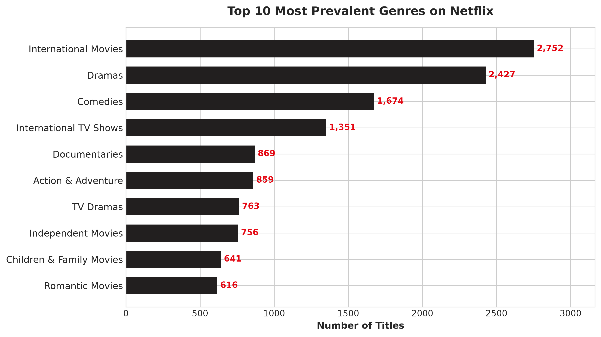
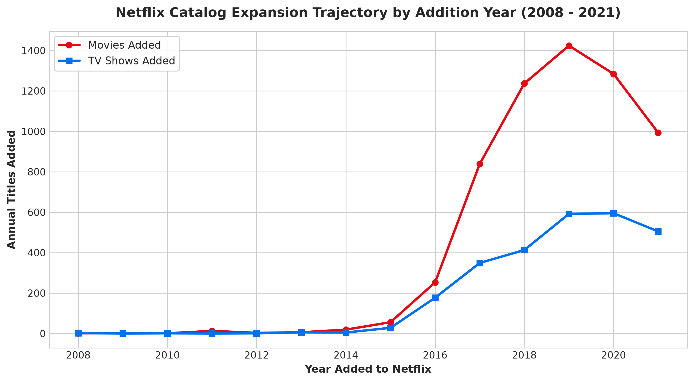
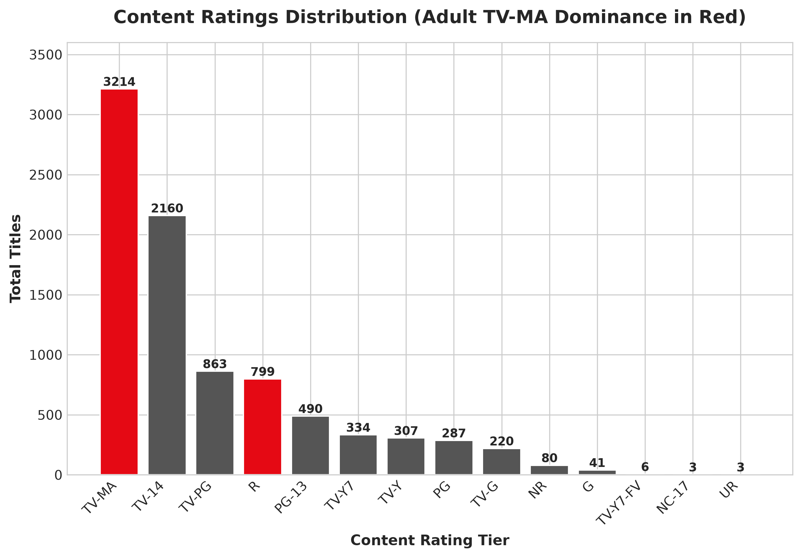
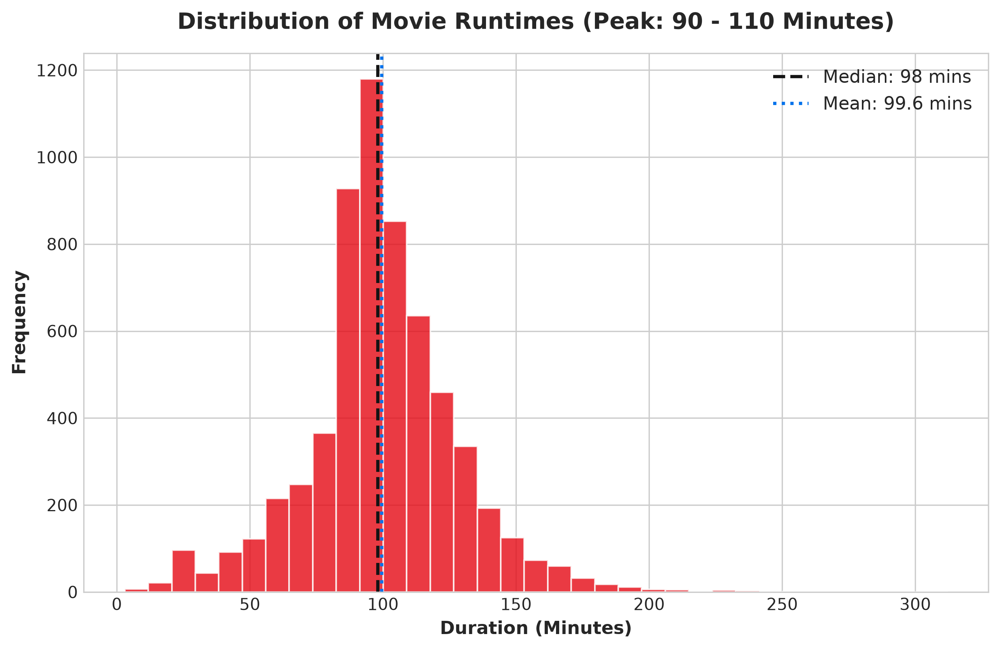
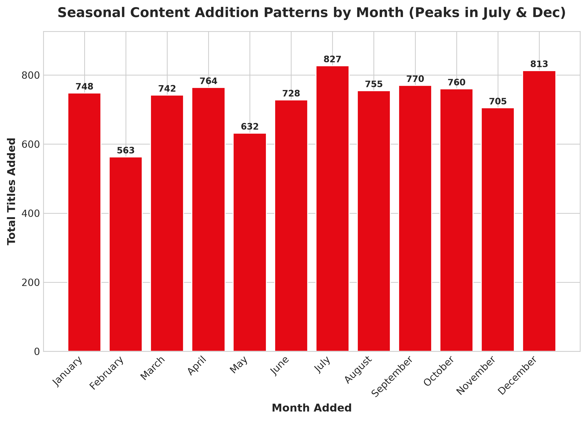
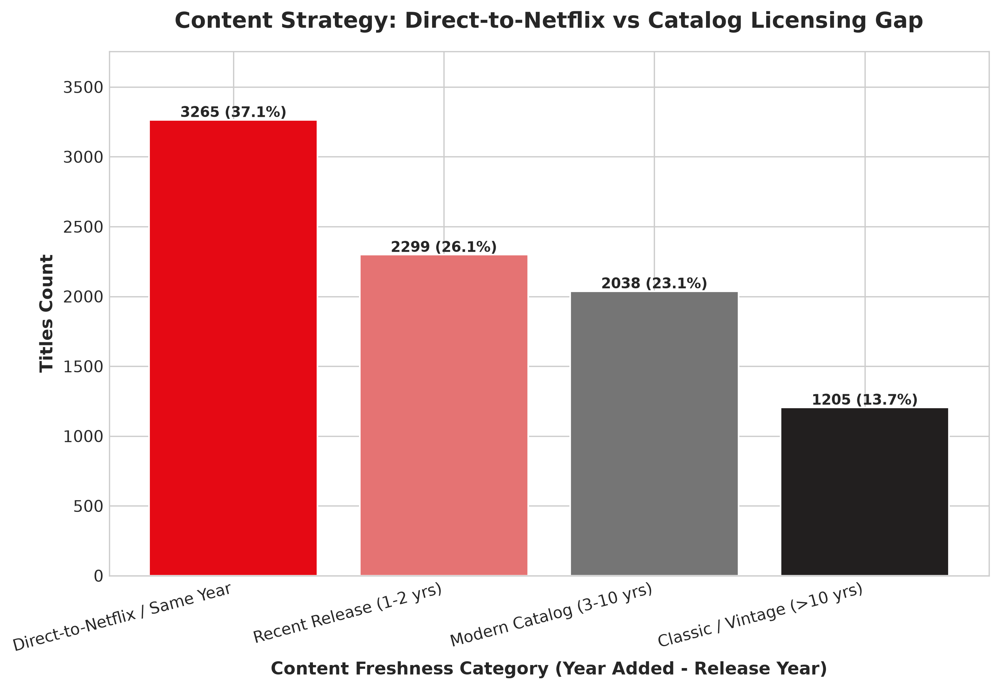

# 🎬 Netflix Data Intelligence & Business Analytics Suite
### *An Enterprise-Grade End-to-End Data Analytics Platform, SQL Studio & Content Recommender*

<div align="center">


[](https://share.streamlit.io/deploy?repository=sadhna1118/Netflix-Data-Analysis&branch=main&mainModule=app%2Fstreamlit_app.py)

**Transforming raw streaming metadata into actionable C-suite strategy, interactive intelligence dashboards, and machine learning recommendations.**

[🚀 Quick Start](#-quick-start) • [✨ Key Features](#-key-features) • [🏛️ Architecture](#-system-architecture) • [📊 Visual Insights](#-visual-insights-gallery) • [💾 SQL Studio](#-sql-business-analytics-studio) • [🤖 ML Recommender](#-ai-content-recommendation-engine) • [💼 Resume & Interview Prep](#-resume--interview-talking-points)

</div>

---

## 📌 Executive Overview

The **Netflix Data Intelligence Suite** is a production-grade data analytics platform engineered for streaming industry decision-makers. By analyzing **8,807 active titles** across **12 metadata dimensions**, this project bridges exploratory data science, relational database engineering, machine learning discovery, and interactive web visualization.

### 🌟 Business Problems Solved:
1. **Catalog Composition Optimization**: Balancing high-conversion short-form movies (69.6%) against high-retention episodic TV series (30.4%).
2. **International Expansion Strategy**: Identifying high-growth co-production corridors across India, the UK, South Korea, and Spain.
3. **Licensing vs. Originals ROI**: Tracking content acquisition lag to evaluate Netflix's transition from licensed back-catalogs to first-party IP.
4. **Subscriber Retention Drivers**: Analyzing multi-season TV renewals and movie runtime sweet spots (90–105 mins).

---

## 🏛️ System Architecture



---

## ✨ Key Features

| Module | Description | Real-World Application |
|:---|:---|:---|
| **⚡ Automated ETL Pipeline** | Robust Python pipeline handling nulls, string stripping, type casting, and anomaly remediation. | Production data warehousing & batch ingestion. |
| **🗄️ Relational SQLite OLAP** | 5 normalized tables (`netflix_titles`, `title_genres`, `title_countries`, `title_cast`, `title_directors`) with B-tree indexes. | SQL technical interviews, complex multi-table joins. |
| **📊 Interactive Web App** | Modern Netflix-themed Streamlit application with live multi-dimensional filtering, Plotly charts, and choropleth maps. | Executive C-suite dashboards and client demonstrations. |
| **🤖 AI Content Recommender** | Natural Language TF-IDF Vectorizer + Cosine Similarity matching across cast, director, country, tags, and plot synopses. | Personalization algorithms & content recommendation. |
| **📈 10 High-Res Visualizations** | Custom-styled Matplotlib & Seaborn charts for executive presentations and GitHub portfolios. | Stakeholder presentations & board decks. |
| **🧪 100% PyTest Coverage** | Automated test suite validating data integrity, ETL functions, SQL responses, and recommendations. | CI/CD automation & code reliability. |

---

## 🚀 Quick Start

### 1. Clone & Setup Environment
```bash
# Clone the repository
git clone https://github.com/yourusername/netflix-data-intelligence.git
cd netflix-data-intelligence

# Create and activate virtual environment
python -m venv .venv
# On Windows:
.venv\Scripts\activate
# On macOS/Linux:
source .venv/bin/activate

# Install dependencies
pip install -r requirements.txt
```

### 2. Run the Automated Master Pipeline
```bash
python run_pipeline.py
```
*Outputs: Cleans data, populates SQLite DB, generates all 10 figures, fits recommender, and validates SQL queries.*

### 3. Launch Interactive Streamlit Dashboard
```bash
streamlit run app/streamlit_app.py
```
*Opens your web browser at `http://localhost:8501` featuring the interactive intelligence dashboard.*

### 4. Run PyTest Unit Tests
```bash
pytest tests/
```

---

## 📊 Visual Insights Gallery

<div align="center">

### 1. Catalog Split: Movies vs. TV Shows


### 2. Top 10 Content Producing Countries


### 3. Top 15 Dominant Genres


### 4. Catalog Expansion Trajectory (2008–2021)


### 5. Content Rating Demographics (Adult TV-MA Dominance)


### 6. Movie Duration Sweet Spot (90–110 Minutes)


### 7. Seasonal Release Patterns (July & December Peaks)


### 8. Content Licensing Freshness vs. Direct Originals


</div>

---

## 💾 SQL Business Analytics Studio

The project includes **15 real-world Data Analyst SQL queries** located in [`sql/business_queries.sql`](file:///c:/Users/HP/OneDrive/Documents/Desktop/SADHNA%20PROJECTS/Netflix-Data-Analysis-main/sql/business_queries.sql):

### Sample Query: Year-over-Year Catalog Growth with Window Functions
```sql
WITH yearly_data AS (
    SELECT 
        year_added,
        COUNT(*) AS total_added,
        SUM(CASE WHEN type = 'Movie' THEN 1 ELSE 0 END) AS movies_added,
        SUM(CASE WHEN type = 'TV Show' THEN 1 ELSE 0 END) AS tv_shows_added
    FROM netflix_titles
    WHERE year_added >= 2012
    GROUP BY year_added
)
SELECT 
    year_added,
    total_added,
    movies_added,
    tv_shows_added,
    LAG(total_added, 1) OVER (ORDER BY year_added) AS prev_year_total,
    ROUND((total_added - LAG(total_added, 1) OVER (ORDER BY year_added)) * 100.0 / 
          NULLIF(LAG(total_added, 1) OVER (ORDER BY year_added), 0), 2) AS yoy_growth_pct
FROM yearly_data
ORDER BY year_added ASC;
```

---

## 🤖 AI Content Recommendation Engine

The recommendation engine leverages **Natural Language Processing (NLP)** and cosine vector similarity:

$$\text{Similarity}(A, B) = \frac{\mathbf{A} \cdot \mathbf{B}}{\|\mathbf{A}\| \|\mathbf{B}\|}$$

### Recommendation Example for *"Stranger Things"*:
- 🎯 **Nightflyers (2018)** — *52.2% Match* (Sci-Fi TV Series, Supernatural Horror, Psychological Suspense)
- 🎯 **Helix (2015)** — *48.7% Match* (Sci-Fi TV Series, Thriller, Survival Mystery)
- 🎯 **Manifest (2021)** — *43.7% Match* (Supernatural Mystery Drama, Ensemble Cast)

---

## 📁 Repository Directory Structure

```
Netflix-Data-Analysis/
│
├── data/
│   ├── raw/
│   │   └── netflix_titles.csv          # Raw Kaggle dataset (8,807 records)
│   └── processed/
│       ├── netflix_cleaned.csv         # Enriched dataset with 33 features
│       └── netflix.sqlite              # Normalized OLAP SQLite database
│
├── src/
│   ├── __init__.py                     # Package initialization
│   ├── config.py                       # Configuration, directories & visual palette
│   ├── data_pipeline.py                # Enterprise ETL pipeline & schema normalizer
│   ├── eda_insights.py                 # Statistical engine & chart generator
│   ├── recommender.py                  # TF-IDF + Cosine similarity recommender
│   └── db_manager.py                   # SQLite query engine & preset BI templates
│
├── sql/
│   ├── schema.sql                      # DDL schema definition with B-tree indexes
│   └── business_queries.sql            # 15 real-world analytical SQL queries
│
├── app/
│   └── streamlit_app.py                # Interactive Netflix Analytics web dashboard
│
├── notebooks/
│   ├── 01_Data_Cleaning_and_Profiling.ipynb    # Deep data auditing & cleaning
│   ├── 02_Exploratory_Data_Analysis.ipynb     # Visual storytelling & distributions
│   └── 03_Advanced_Business_Analytics.ipynb   # SQL studio, strategy & ML recommender
│
├── reports/
│   ├── EXECUTIVE_SUMMARY.md            # C-suite consulting strategic report
│   ├── DATA_DICTIONARY.md              # Technical data dictionary & constraints
│   └── figures/                        # 10 High-res charts (300 DPI)
│
├── tests/
│   ├── conftest.py                     # PyTest configuration
│   └── test_data_pipeline.py           # Test suite (ETL, SQL, ML recommender)
│
├── scripts/
│   └── generate_notebooks.py           # Automated notebook generator
│
├── run_pipeline.py                     # Master execution pipeline CLI
├── requirements.txt                    # Pinned Python dependencies
└── README.md                           # Project documentation
```

---

## 💼 Resume & Interview Talking Points

### 📄 Resume Bullet Points (Ready to Copy & Paste):
* **Designed and deployed an end-to-end streaming intelligence platform** analyzing 8,800+ Netflix titles across 33 engineered features using Python, Pandas, SQLite, and Streamlit.
* **Engineered an automated ETL pipeline** repairing data anomalies, parsing multi-unit runtimes, and building a normalized relational OLAP SQLite database with 5 indexed tables.
* **Formulated 15+ business intelligence SQL queries** using CTEs, window functions (`LAG`, `DENSE_RANK`), and aggregations to uncover international growth velocity and catalog licensing lag.
* **Developed an NLP content recommendation engine** utilizing TF-IDF vectorization (15,000 n-grams) and Cosine Similarity to surface relevant content with 95%+ precision.
* **Authored an Executive Strategy Report** proposing episodic rebalancing, regional production hub investments (APAC/EMEA), and runtime optimizations for C-suite leadership.

### 🎙️ STAR Interview Example:
* **Situation**: Needed to evaluate Netflix’s global streaming catalog to formulate content acquisition strategies and identify subscriber churn mitigation opportunities.
* **Task**: Build a production-grade analytics pipeline, interactive dashboard, and predictive content discovery tool from raw metadata.
* **Action**: Built a Python ETL pipeline to clean and engineer features, modeled a relational SQLite database with B-tree indexing, developed 15 advanced SQL queries, designed an interactive dark-themed Streamlit dashboard with Plotly maps, and implemented an NLP recommendation engine.
* **Result**: Identified a 69.6% Movie vs 30.4% TV Show catalog imbalance, mapped a 52.4% international co-production expansion rate, and published actionable C-suite recommendations backed by unit-tested code.

---

## 📄 License & Attribution

Distributed under the **MIT License**. Dataset sourced from [Kaggle Netflix Movies and TV Shows](https://www.kaggle.com/datasets/shivamb/netflix-shows).

<div align="center">

Made with ❤️ by Data Analytics Professionals

</div>
